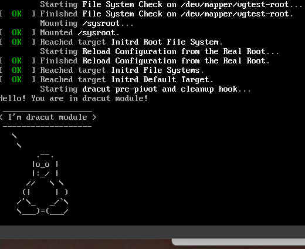

# Home 07 Загрузка системы

<details>
  <summary>home 07</summary>

### Загрузка системы

<details>
  <summary>Попасть в систему без пароля</summary>
Выполняется на VirtualBox, Ubuntu 22.04

Вариант 1.

Для входа в загрузчик в данном случае требуется во время загшрузки ВМ зажать shift, в появившемся меню жмем e, попадаем в конфиг.
Находим строку, начинающуюся на linux. В конце строки, видим 2 параметра, отвечающих за загрузку, quiet splash - вывод минимальной информмации и показ заставки, удалим их, вместо них прописываем verbose init=/bin/bash, жмем ctrl+X для загрузки текущей конфигурации.

загружаемся, попадаем в оболочку. При данной загрузке файловая система монтируется только для чтения, перемонтируем корневой раздел, чтобы иметь возможность сброса пароля
```mount - remount,rw /```
устанавливаем новый пароль
```passwd root```
Набираем exit ииииииииии.... получаем зависшую консоль с ошибкой kernel panic. Причина - убунту не прогружает в оболочку по умолчанию ничего, из советов в интернетах предлагают вручную монтировать /proc и т.п. Немного порывшись приходим к следующему:

Ребуетаем тачку, идем в grub, и в той же строке удаляем все что после ro, ro  меняем на rw, после него пишем init=/bin/bash, жмакаем ctrl+x
попадаем в оболочку, диск уже подключен на запись - для некоторых операционок сразу на запись указывать загрузку ядра запрещено
набираем passwd, указываем пароль, для выхода пишем 
```exec /sbin/init```
выполняется загрузка 
проверяем - запускаем терминал, входим под рутом 
```su - root```
вводим новый пароль

Вариант 2. - рекомендуемый вариант в интрнетах работает только в том случае, если пароль рута не был установлен до этого. 
Заходим в grub, проходим в расширенные опции, выбираем recovery mode, выбираем сброс пароля рута, грузимся, маунтим диск на редактирование, меняем пароль. Если был ранее установлен пароль рута, то он будет запрошен при попытке запустить оболочку.
</details>


<details>
  <summary>Переименование VG в LVM</summary>
смотрим текущее состояние
```
root@home03:~# vgs
  VG       #PV #LV #SN Attr   VSize  VFree 
  vgubuntu   1   2   0 wz--n- 19,49g 32,00m
```


переименовываем 
```
root@home03:~# vgrename vgubuntu vgtest
  Volume group "vgubuntu" successfully renamed to "vgtest"
```

правим /etc/fstab, /etc/default/grub, /boot/grub/grub.cfg - заменяем старое имя на новое где встречаем
на моей бубунте /boot/grub2/grub.cfg нет, правим /boot/grub/grub.cfg

выполняем 
```mkinitrd -f -v /boot/initramfs-$(uname -r).img $(uname -r)```
получаем ошибку, что он не установлен, ставим и выполняем еще раз

```apt install dracut-core -y```

```mkinitrd -f -v /boot/initramfs-$(uname -r).img $(uname -r)```

```
dracut: drwxr-xr-x   2 root     root            0 Dec  1 22:24 var/tmp
dracut: ========================================================================
dracut: *** Creating initramfs image file '/boot/initramfs-6.2.0-36-generic.img' done ***

```

перезагружаемся, проверяем

```
root@home03:~# vgs
  VG     #PV #LV #SN Attr   VSize  VFree 
  vgtest   1   2   0 wz--n- 19,49g 32,00m
```

</details>


<details>
  <summary>Добавить модуль в initrd</summary>
создаем каталог mkdir /usr/lib/dracut/modules.d/01test  
добавляем скрипты module-setup.sh, test.sh  
собираем   

```
dracut -f -v
```

удаляем из /boot/grub/grub.cfg  
rghb и quiet  
у меня только quiet, rghb нет  
ребут  

</details>
</details>